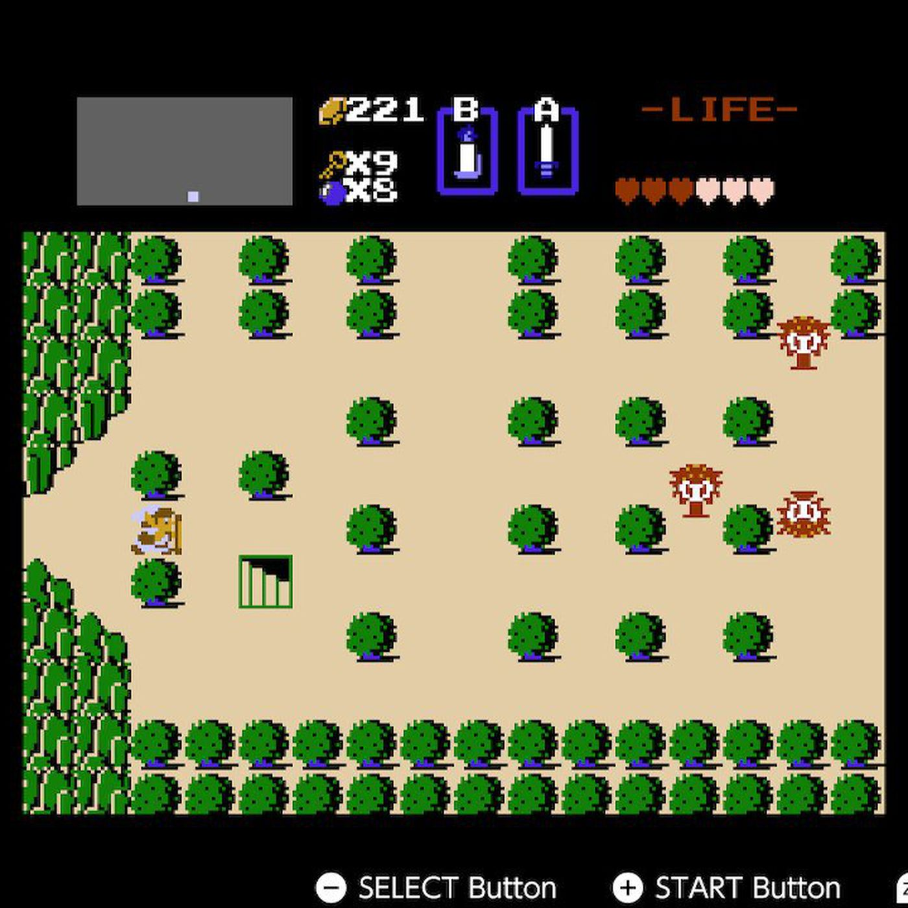

# Rogue Runner
*A procedurally generated roguelite game inspired by The Legend of Zelda.*

## Contents

1. [Introduction](#introduction)
2. [Gameplay](#gameplay)
3. [Controls](#controls)
4. [Enemies](#enemies)
5. [Weapons and Items](#weapons-and-items)
6. [Levels and Progression](#levels-and-progression)
7. [Bosses](#bosses)
8. [Secrets and Easter Eggs](#secrets-and-easter-eggs)
9. [Tips and Strategies](#tips-and-strategies)
10. [Technical Requirements](#technical-requirements)

## Introduction

||
|:---------------------------------------------------------------------:|
| **Figure 1:** Inspiration image from the 80s game The Legend of Zelda |